# Login Process Sequence Diagram

## Overview
This document provides comprehensive sequence diagrams for the user login process, including all test cases and scenarios.

## 1. Successful Login Flow

```mermaid
sequenceDiagram
    participant U as 👤 User
    participant CP as 🛒 Customer Portal
    participant CA as 🛍️ Customer API
    participant DB as 🗄️ Database

    Note over U,DB: Happy Path - Successful Login

    U->>CP: Fill login form<br/>(email, password)
    CP->>CP: Validate form data
    CP->>CA: POST /login<br/>Authorization: Basic base64(email:password)
    CA->>CA: Decode Basic Auth credentials
    CA->>CA: Validate email format
    CA->>DB: Find user by email
    DB-->>CA: User found
    CA->>CA: Check if user is verified
    CA->>CA: Check if account is not locked
    CA->>CA: Verify password hash
    CA->>CA: Generate JWT token
    CA->>DB: Update last login timestamp
    DB-->>CA: Timestamp updated
    CA-->>CP: 200 OK<br/>{token: "jwt_token_here"}
    CP->>CP: Store token in localStorage
    CP->>CP: Store user data
    CP-->>U: Redirect to dashboard<br/>Show welcome message
```

## 2. Invalid Credentials Test Case

```mermaid
sequenceDiagram
    participant U as 👤 User
    participant CP as 🛒 Customer Portal
    participant CA as 🛍️ Customer API
    participant DB as 🗄️ Database

    Note over U,DB: Test Case - Invalid Credentials

    U->>CP: Fill login form<br/>(email, wrong_password)
    CP->>CP: Validate form data
    CP->>CA: POST /login<br/>Authorization: Basic base64(email:wrong_password)
    CA->>CA: Decode Basic Auth credentials
    CA->>CA: Validate email format
    CA->>DB: Find user by email
    DB-->>CA: User found
    CA->>CA: Check if user is verified
    CA->>CA: Check if account is not locked
    CA->>CA: Verify password hash
    Note right of CA: Password verification fails
    CA-->>CP: 401 Unauthorized<br/>"Bad credentials"
    CP-->>U: Show error message<br/>"Invalid email or password"
```

## 3. User Not Found Test Case

```mermaid
sequenceDiagram
    participant U as 👤 User
    participant CP as 🛒 Customer Portal
    participant CA as 🛍️ Customer API
    participant DB as 🗄️ Database

    Note over U,DB: Test Case - User Not Found

    U->>CP: Fill login form<br/>(non_existent_email, password)
    CP->>CP: Validate form data
    CP->>CA: POST /login<br/>Authorization: Basic base64(non_existent_email:password)
    CA->>CA: Decode Basic Auth credentials
    CA->>CA: Validate email format
    CA->>DB: Find user by email
    DB-->>CA: User not found
    CA-->>CP: 401 Unauthorized<br/>"Bad credentials"
    CP-->>U: Show error message<br/>"Invalid email or password"
```

## 4. Unverified Account Test Case

## 5. Locked Account Test Case

## 6. Suspended Account Test Case

```mermaid
sequenceDiagram
    participant U as 👤 User
    participant CP as 🛒 Customer Portal
    participant CA as 🛍️ Customer API
    participant DB as 🗄️ Database

    Note over U,DB: Test Case - Suspended Account

    U->>CP: Fill login form<br/>(email, password)
    CP->>CP: Validate form data
    CP->>CA: POST /login<br/>Authorization: Basic base64(email:password)
    CA->>CA: Decode Basic Auth credentials
    CA->>CA: Validate email format
    CA->>DB: Find user by email
    DB-->>CA: User found (suspended)
    CA->>CA: Check if user is verified
    CA->>CA: Check if account is not locked
    Note right of CA: Account is suspended
    CA-->>CP: 401 Unauthorized<br/>"User account is suspended"
    CP-->>U: Show error message<br/>"Account is suspended. Contact support."
```

## 7. Invalid Email Format Test Case

```mermaid
sequenceDiagram
    participant U as 👤 User
    participant CP as 🛒 Customer Portal
    participant CA as 🛍️ Customer API

    Note over U,CA: Test Case - Invalid Email Format

    U->>CP: Fill login form<br/>(invalid_email, password)
    CP->>CP: Validate form data
    CP->>CA: POST /login<br/>Authorization: Basic base64(invalid_email:password)
    CA->>CA: Decode Basic Auth credentials
    CA->>CA: Validate email format
    Note right of CA: Email format is invalid
    CA-->>CP: 400 Bad Request<br/>"Invalid email address"
    CP-->>U: Show error message<br/>"Please enter a valid email"
```

## 8. Missing Credentials Test Case

```mermaid
sequenceDiagram
    participant U as 👤 User
    participant CP as 🛒 Customer Portal
    participant CA as 🛍️ Customer API

    Note over U,CA: Test Case - Missing Credentials

    U->>CP: Submit form<br/>(empty email/password)
    CP->>CP: Validate form data
    CP->>CA: POST /login<br/>Authorization: Basic base64(:)
    CA->>CA: Decode Basic Auth credentials
    Note right of CA: Empty credentials
    CA-->>CP: 401 Unauthorized<br/>"Authentication required"
    CP-->>U: Show error message<br/>"Please enter email and password"
```

## 9. Network Error Test Case

## 10. Server Error Test Case

```mermaid
sequenceDiagram
    participant U as 👤 User
    participant CP as 🛒 Customer Portal
    participant CA as 🛍️ Customer API
    participant DB as 🗄️ Database

    Note over U,DB: Test Case - Server Error

    U->>CP: Fill login form<br/>(email, password)
    CP->>CP: Validate form data
    CP->>CA: POST /login<br/>Authorization: Basic base64(email:password)
    CA->>CA: Decode Basic Auth credentials
    CA->>CA: Validate email format
    CA->>DB: Find user by email
    Note right of DB: Database connection error
    DB-->>CA: Database Error
    CA-->>CP: 500 Internal Server Error<br/>"Server error occurred"
    CP-->>U: Show error message<br/>"Server error, please try later"
```

## 11. Rate Limiting Test Case

## 12. Token Refresh Flow

```mermaid
sequenceDiagram
    participant U as 👤 User
    participant CP as 🛒 Customer Portal
    participant CA as 🛍️ Customer API
    participant DB as 🗄️ Database

    Note over U,DB: Token Refresh Process

    U->>CP: Access protected resource
    CP->>CP: Check token expiration
    CP->>CA: POST /refresh-token<br/>Authorization: Bearer expired_token
    CA->>CA: Validate refresh token
    CA->>DB: Verify token in database
    DB-->>CA: Token valid
    CA->>CA: Generate new access token
    CA->>DB: Update token timestamp
    DB-->>CA: Token updated
    CA-->>CP: 200 OK<br/>{token: "new_jwt_token"}
    CP->>CP: Update stored token
    CP-->>U: Continue with request
```

## Test Cases Summary

| Test Case | Description | Expected Result | HTTP Status |
|-----------|-------------|-----------------|-------------|
| **TC001** | Valid credentials | Login successful, JWT token returned | 200 OK |
| **TC002** | Invalid password | Authentication error displayed | 401 Unauthorized |
| **TC003** | User not found | Authentication error displayed | 401 Unauthorized |
| **TC004** | Unverified account | Verification required message | 401 Unauthorized |
| **TC005** | Locked account | Account locked message | 401 Unauthorized |
| **TC006** | Suspended account | Account suspended message | 401 Unauthorized |
| **TC007** | Invalid email format | Email validation error | 400 Bad Request |
| **TC008** | Missing credentials | Authentication required message | 401 Unauthorized |
| **TC009** | Network error | Network error message | Network Error |
| **TC010** | Server error | Server error message | 500 Internal Server Error |
| **TC011** | Rate limiting | Too many attempts message | 429 Too Many Requests |
| **TC012** | Token refresh | New token issued | 200 OK |

## Authentication Flow

### Basic Authentication
- Uses HTTP Basic Authentication header
- Format: `Authorization: Basic base64(email:password)`
- Secure transmission over HTTPS

### JWT Token Management
- Token expiration: 24 hours
- Refresh token expiration: 7 days
- Automatic token refresh on expiration
- Secure token storage in localStorage

## Security Considerations

### Password Security
- Passwords are hashed using BCrypt
- Salt is automatically generated
- No password logging or transmission in plain text

### Session Management
- JWT tokens for stateless authentication
- Token blacklisting for logout
- Automatic session cleanup

### Rate Limiting
- Maximum 5 login attempts per 15 minutes
- IP-based rate limiting
- Progressive delays for repeated failures

### Account Protection
- Account locking after 5 failed attempts
- Automatic unlock after 30 minutes
- Admin notification for suspicious activity

## Error Handling Strategy

### Frontend Error Handling
- Real-time form validation
- Clear error messages
- Retry mechanisms for network errors
- Graceful degradation

### Backend Error Handling
- Comprehensive input validation
- Proper HTTP status codes
- Detailed error logging
- Security-focused error messages

## Validation Rules

### Email Validation
- Must be a valid email format
- Must not be empty
- Maximum length: 255 characters

### Password Validation
- Must not be empty
- Minimum length: 1 character (for login)
- No maximum length restriction

### Form Validation
- Both email and password are required
- Real-time validation feedback
- Submit button disabled until valid 