# Order and Payment Process Sequence Diagram

## Overview
This document provides comprehensive sequence diagrams for the order and payment process, including all operations from checkout to order confirmation.

## 1. Complete Order and Payment Flow

```mermaid
sequenceDiagram
    participant U as 👤 User
    participant CP as 🛒 Customer Portal
    participant CA as 🛍️ Customer API
    participant DB as 🗄️ Database
    participant PG as 💳 Payment Gateway
    participant ES as 📧 Email Service

    Note over U,ES: Complete Order and Payment Process

    U->>CP: Click "Proceed to Checkout"
    CP->>CP: Validate cart is not empty
    CP->>CA: GET /cart<br/>Authorization: Bearer token
    CA->>CA: Validate JWT token
    CA->>DB: Fetch cart items and totals
    DB-->>CA: Cart data retrieved
    CA-->>CP: 200 OK<br/>{items: [...], total: amount, itemCount: count}
    CP->>CP: Navigate to checkout page
    U->>CP: Fill shipping address
    U->>CP: Fill billing address
    U->>CP: Select payment method
    U->>CP: Enter payment details
    U->>CP: Review order summary
    U->>CP: Click "Place Order"
    CP->>CP: Validate all form data
    CP->>CA: POST /orders/create<br/>Authorization: Bearer token<br/>{orderData, paymentInfo, addresses}
    CA->>CA: Validate JWT token
    CA->>CA: Validate order data
    CA->>DB: Check product availability
    DB-->>CA: Products available
    CA->>DB: Lock inventory for order
    DB-->>CA: Inventory locked
    CA->>PG: Process payment<br/>{amount, paymentMethod, cardDetails}
    PG->>PG: Validate payment details
    PG->>PG: Process transaction
    PG-->>CA: Payment successful<br/>{transactionId: "txn_123", status: "succeeded"}
    CA->>DB: Create order record
    DB-->>CA: Order created<br/>{orderId: "ORD-12345"}
    CA->>DB: Create order items
    DB-->>CA: Order items created
    CA->>DB: Update product inventory
    DB-->>CA: Inventory updated
    CA->>DB: Clear user's cart
    DB-->>CA: Cart cleared
    CA->>ES: Send order confirmation email
    ES-->>CA: Email sent successfully
    CA-->>CP: 201 Created<br/>{orderId: "ORD-12345", message: "Order placed successfully"}
    CP->>CP: Clear cart display
    CP->>CP: Show order confirmation
    CP-->>U: Display order confirmation<br/>Show order ID and details
```



## 2. Payment Processing Flow

```mermaid
sequenceDiagram
    participant U as 👤 User
    participant CP as 🛒 Customer Portal
    participant CA as 🛍️ Customer API
    participant PG as 💳 Payment Gateway
    participant DB as 🗄️ Database

    Note over U,DB: Payment Processing Details

    U->>CP: Submit payment information
    CP->>CP: Encrypt sensitive payment data
    CP->>CA: POST /payment/process<br/>Authorization: Bearer token<br/>{encryptedPaymentData}
    CA->>CA: Validate payment data
    CA->>CA: Decrypt payment information
    CA->>PG: Create payment intent<br/>{amount, currency, paymentMethod}
    PG-->>CA: Payment intent created<br/>{intentId: "pi_123"}
    CA->>PG: Confirm payment<br/>{intentId, cardDetails}
    PG->>PG: Validate card details
    PG->>PG: Check card balance
    PG->>PG: Process transaction
    PG-->>CA: Payment confirmed<br/>{transactionId: "txn_123", status: "succeeded"}
    CA->>DB: Store payment record
    DB-->>CA: Payment stored
    CA->>DB: Update order payment status
    DB-->>CA: Order status updated
    CA-->>CP: 200 OK<br/>{paymentStatus: "success", transactionId: "txn_123"}
    CP-->>U: Show payment success<br/>Proceed to order confirmation
```



## 3. Order Creation Flow

```mermaid
sequenceDiagram
    participant U as 👤 User
    participant CP as 🛒 Customer Portal
    participant CA as 🛍️ Customer API
    participant DB as 🗄️ Database

    Note over U,DB: Order Creation Process

    U->>CP: Submit order
    CP->>CP: Validate order data
    CP->>CA: POST /orders/create<br/>Authorization: Bearer token<br/>{orderData}
    CA->>CA: Validate JWT token
    CA->>CA: Validate order data
    CA->>DB: Check product availability
    DB-->>CA: Products available
    CA->>DB: Create order header
    DB-->>CA: Order header created<br/>{orderId: "ORD-12345"}
    CA->>DB: Create order items
    DB-->>CA: Order items created
    CA->>DB: Calculate order totals
    DB-->>CA: Totals calculated
    CA->>DB: Update order with totals
    DB-->>CA: Order updated
    CA->>DB: Clear user's cart
    DB-->>CA: Cart cleared
    CA-->>CP: 201 Created<br/>{orderId: "ORD-12345", orderDetails}
    CP->>CP: Store order information
    CP-->>U: Show order created<br/>Proceed to payment
```



## 4. Payment Failure Test Case

```mermaid
sequenceDiagram
    participant U as 👤 User
    participant CP as 🛒 Customer Portal
    participant CA as 🛍️ Customer API
    participant PG as 💳 Payment Gateway
    participant DB as 🗄️ Database

    Note over U,DB: Test Case - Payment Failure

    U->>CP: Submit payment information
    CP->>CP: Encrypt payment data
    CP->>CA: POST /payment/process<br/>Authorization: Bearer token<br/>{encryptedPaymentData}
    CA->>CA: Validate payment data
    CA->>PG: Create payment intent<br/>{amount, currency, paymentMethod}
    PG-->>CA: Payment intent created
    CA->>PG: Confirm payment<br/>{intentId, cardDetails}
    PG->>PG: Validate card details
    PG->>PG: Check card balance
    Note right of PG: Insufficient funds
    PG-->>CA: Payment failed<br/>{error: "Insufficient funds"}
    CA->>DB: Store failed payment attempt
    DB-->>CA: Failed payment recorded
    CA->>DB: Unlock inventory
    DB-->>CA: Inventory unlocked
    CA-->>CP: 400 Bad Request<br/>{error: "Payment failed", reason: "Insufficient funds"}
    CP-->>U: Show payment error<br/>Request new payment method
```



## 5. Insufficient Stock During Checkout Test Case


## 6. Invalid Payment Method Test Case


## 7. Order Confirmation Email Flow

```mermaid
sequenceDiagram
    participant U as 👤 User
    participant CP as 🛒 Customer Portal
    participant CA as 🛍️ Customer API
    participant ES as 📧 Email Service

    Note over U,ES: Order Confirmation Email

    Note right of CA: After successful order creation
    CA->>ES: Send order confirmation email<br/>{orderId, userEmail, orderDetails}
    ES->>ES: Generate email content
    ES->>ES: Send email to user
    ES-->>CA: Email sent successfully
    CA->>CP: Order confirmation response
    CP-->>U: Show order confirmation<br/>"Check your email for confirmation"
```



## 8. Order Tracking Flow

```mermaid
sequenceDiagram
    participant U as 👤 User
    participant CP as 🛒 Customer Portal
    participant CA as 🛍️ Customer API
    participant DB as 🗄️ Database

    Note over U,DB: Order Tracking

    U->>CP: Navigate to order history
    CP->>CP: Check authentication
    CP->>CA: GET /orders<br/>Authorization: Bearer token
    CA->>CA: Validate JWT token
    CA->>DB: Fetch user's orders
    DB-->>CA: Orders retrieved
    CA-->>CP: 200 OK<br/>{orders: [...]}
    CP->>CP: Display order list
    U->>CP: Click on specific order
    CP->>CA: GET /orders/{orderId}<br/>Authorization: Bearer token
    CA->>CA: Validate JWT token
    CA->>DB: Fetch order details
    DB-->>CA: Order details retrieved
    CA-->>CP: 200 OK<br/>{orderDetails, status, tracking}
    CP->>CP: Display order details
    CP-->>U: Show order status<br/>Display tracking information
```



## 9. Order Cancellation Flow


## 10. Network Error During Payment Test Case

```mermaid
sequenceDiagram
    participant U as 👤 User
    participant CP as 🛒 Customer Portal
    participant CA as 🛍️ Customer API
    participant PG as 💳 Payment Gateway

    Note over U,PG: Test Case - Network Error During Payment

    U->>CP: Submit payment information
    CP->>CP: Encrypt payment data
    CP->>CA: POST /payment/process<br/>Authorization: Bearer token<br/>{encryptedPaymentData}
    CA->>CA: Validate payment data
    CA->>PG: Create payment intent
    Note right of PG: Network timeout/error
    PG-->>CA: Network Error
    CA-->>CP: 500 Internal Server Error<br/>{error: "Payment service unavailable"}
    CP-->>U: Show network error<br/>"Please try again later"
```



## Test Cases Summary

| Test Case | Description | Expected Result | HTTP Status |
|-----------|-------------|-----------------|-------------|
| **TC001** | Complete order and payment | Order created, payment processed | 201 Created |
| **TC002** | Payment processing | Payment successful, transaction recorded | 200 OK |
| **TC003** | Order creation | Order created, cart cleared | 201 Created |
| **TC004** | Payment failure | Error displayed, inventory unlocked | 400 Bad Request |
| **TC005** | Insufficient stock | Stock error, cart updated | 400 Bad Request |
| **TC006** | Invalid payment method | Payment method error | 400 Bad Request |
| **TC007** | Order confirmation email | Email sent successfully | Email Sent |
| **TC008** | Order tracking | Order details displayed | 200 OK |
| **TC009** | Order cancellation | Order cancelled, refund processed | 200 OK |
| **TC010** | Network error during payment | Network error message | 500 Internal Server Error |

## Order Data Structure

### Order Request
```json
{
  "shippingAddress": {
    "street": "123 Main St",
    "city": "New York",
    "state": "NY",
    "zipCode": "10001",
    "country": "USA"
  },
  "billingAddress": {
    "street": "123 Main St",
    "city": "New York",
    "state": "NY",
    "zipCode": "10001",
    "country": "USA"
  },
  "paymentMethod": "credit_card",
  "paymentDetails": {
    "cardNumber": "encrypted_card_number",
    "expiryDate": "12/25",
    "cvv": "encrypted_cvv"
  }
}
```

### Order Response
```json
{
  "orderId": "ORD-12345",
  "status": "confirmed",
  "total": 129.99,
  "shippingCost": 9.99,
  "tax": 10.40,
  "grandTotal": 150.38,
  "items": [
    {
      "productId": "prod_123",
      "productName": "Product Name",
      "quantity": 2,
      "price": 59.99,
      "subtotal": 119.98
    }
  ],
  "shippingAddress": {...},
  "billingAddress": {...},
  "paymentStatus": "paid",
  "transactionId": "txn_123",
  "createdAt": "2024-01-15T10:30:00Z"
}
```

## Payment Processing

### Payment Methods
- Credit/Debit Cards
- Digital Wallets (PayPal, Apple Pay)
- Bank Transfers
- Cryptocurrency (optional)

### Security Measures
- PCI DSS compliance
- End-to-end encryption
- Tokenization of sensitive data
- Fraud detection systems

## Order Status Flow

### Order Statuses
1. **Pending** - Order created, awaiting payment
2. **Confirmed** - Payment received, order confirmed
3. **Processing** - Order being prepared
4. **Shipped** - Order shipped with tracking
5. **Delivered** - Order delivered successfully
6. **Cancelled** - Order cancelled and refunded

### Status Transitions
- Pending → Confirmed (after payment)
- Confirmed → Processing (when preparing)
- Processing → Shipped (when shipped)
- Shipped → Delivered (when delivered)
- Any status → Cancelled (when cancelled)

## Error Handling Strategy

### Payment Errors
- Insufficient funds
- Invalid card details
- Expired cards
- Network timeouts
- Payment gateway errors

### Order Errors
- Insufficient stock
- Invalid addresses
- Missing payment information
- System errors

### Recovery Mechanisms
- Automatic retry for network errors
- Inventory restoration on failure
- Partial order processing
- Manual intervention for complex issues

## Security Considerations

### Payment Security
- PCI DSS compliance
- Encryption of sensitive data
- Secure payment gateway integration
- Fraud detection and prevention

### Order Security
- User authentication required
- Order ownership validation
- Secure order data transmission
- Audit logging for all operations

### Data Protection
- Personal data encryption
- Secure storage practices
- GDPR compliance
- Data retention policies 