# Registration Process Sequence Diagram

## Overview
This document provides comprehensive sequence diagrams for the user registration process, including all test cases and scenarios.

## 1. Successful Registration Flow

```mermaid
sequenceDiagram
    participant U as 👤 User
    participant CP as 🛒 Customer Portal
    participant CA as 🛍️ Customer API
    participant DB as 🗄️ Database
    participant ES as 📧 Email Service

    Note over U,ES: Happy Path - Successful Registration

    U->>CP: Fill registration form<br/>(name, email, password)
    CP->>CP: Validate form data
    CP->>CA: POST /users/register<br/>{name, email, password}
    CA->>CA: Validate input data
    CA->>DB: Check if email exists
    DB-->>CA: Email not found
    CA->>CA: Hash password
    CA->>DB: Save user data
    DB-->>CA: User saved successfully
    CA->>CA: Generate verification token
    CA->>DB: Save verification token
    DB-->>CA: Token saved
    CA->>ES: Send verification email
    ES-->>CA: Email sent successfully
    CA-->>CP: 201 Created<br/>"User registered successfully"
    CP-->>U: Show success message<br/>"Check your email for verification"
```

## 2. Email Already Exists Test Case

```mermaid
sequenceDiagram
    participant U as 👤 User
    participant CP as 🛒 Customer Portal
    participant CA as 🛍️ Customer API
    participant DB as 🗄️ Database

    Note over U,DB: Test Case - Email Already Exists

    U->>CP: Fill registration form<br/>(existing email)
    CP->>CP: Validate form data
    CP->>CA: POST /users/register<br/>{name, email, password}
    CA->>CA: Validate input data
    CA->>DB: Check if email exists
    DB-->>CA: Email already exists
    CA-->>CP: 409 Conflict<br/>"User already exists"
    CP-->>U: Show error message<br/>"Email already registered"
```

## 3. Email Already Exists But Not Verified Test Case

```mermaid
sequenceDiagram
    participant U as 👤 User
    participant CP as 🛒 Customer Portal
    participant CA as 🛍️ Customer API
    participant DB as 🗄️ Database
    participant ES as 📧 Email Service

    Note over U,ES: Test Case - Email Exists But Not Verified

    U->>CP: Fill registration form<br/>(unverified email)
    CP->>CP: Validate form data
    CP->>CA: POST /users/register<br/>{name, email, password}
    CA->>CA: Validate input data
    CA->>DB: Check if email exists
    DB-->>CA: Email exists but not verified
    CA->>CA: Generate new verification token
    CA->>DB: Update verification token
    DB-->>CA: Token updated
    CA->>ES: Send new verification email
    ES-->>CA: Email sent successfully
    CA-->>CP: 409 Conflict<br/>"User already exists but not verified.<br/>New verification email sent."
    CP-->>U: Show info message<br/>"New verification email sent"
```

## 4. Invalid Email Format Test Case

```mermaid
sequenceDiagram
    participant U as 👤 User
    participant CP as 🛒 Customer Portal
    participant CA as 🛍️ Customer API

    Note over U,CA: Test Case - Invalid Email Format

    U->>CP: Fill registration form<br/>(invalid email format)
    CP->>CP: Validate form data
    CP->>CA: POST /users/register<br/>{name, invalid_email, password}
    CA->>CA: Validate email format
    CA-->>CP: 400 Bad Request<br/>"Invalid email address"
    CP-->>U: Show error message<br/>"Please enter a valid email"
```

## 5. Weak Password Test Case

## 6. Missing Required Fields Test Case

```mermaid
sequenceDiagram
    participant U as 👤 User
    participant CP as 🛒 Customer Portal
    participant CA as 🛍️ Customer API

    Note over U,CA: Test Case - Missing Required Fields

    U->>CP: Submit form<br/>(missing name/email/password)
    CP->>CP: Validate form data
    CP->>CA: POST /users/register<br/>{incomplete_data}
    CA->>CA: Validate required fields
    CA-->>CP: 400 Bad Request<br/>"Missing required fields"
    CP-->>U: Show error message<br/>"Please fill all required fields"
```

## 7. Email Verification Flow

```mermaid
sequenceDiagram
    participant U as 👤 User
    participant CP as 🛒 Customer Portal
    participant CA as 🛍️ Customer API
    participant DB as 🗄️ Database

    Note over U,DB: Email Verification Process

    U->>CP: Click verification link<br/>from email
    CP->>CP: Extract token from URL
    CP->>CA: POST /users/verify<br/>{token}
    CA->>CA: Validate token format
    CA->>DB: Find user by token
    DB-->>CA: User found
    CA->>CA: Check token expiration
    CA->>DB: Mark user as verified
    DB-->>CA: User verified
    CA->>DB: Delete verification token
    DB-->>CA: Token deleted
    CA-->>CP: 200 OK<br/>"Account successfully verified"
    CP-->>U: Show success message<br/>Redirect to login
```

## 8. Invalid Verification Token Test Case

```mermaid
sequenceDiagram
    participant U as 👤 User
    participant CP as 🛒 Customer Portal
    participant CA as 🛍️ Customer API
    participant DB as 🗄️ Database

    Note over U,DB: Test Case - Invalid Verification Token

    U->>CP: Click verification link<br/>(invalid token)
    CP->>CP: Extract token from URL
    CP->>CA: POST /users/verify<br/>{invalid_token}
    CA->>CA: Validate token format
    CA->>DB: Find user by token
    DB-->>CA: Token not found
    CA-->>CP: 404 Not Found<br/>"Invalid verification token"
    CP-->>U: Show error message<br/>"Invalid or expired token"
```

## 9. Expired Verification Token Test Case

```mermaid
sequenceDiagram
    participant U as 👤 User
    participant CP as 🛒 Customer Portal
    participant CA as 🛍️ Customer API
    participant DB as 🗄️ Database

    Note over U,DB: Test Case - Expired Verification Token

    U->>CP: Click verification link<br/>(expired token)
    CP->>CP: Extract token from URL
    CP->>CA: POST /users/verify<br/>{expired_token}
    CA->>CA: Validate token format
    CA->>DB: Find user by token
    DB-->>CA: User found with expired token
    CA->>CA: Check token expiration
    CA-->>CP: 400 Bad Request<br/>"Verification token expired"
    CP-->>U: Show error message<br/>"Token expired, please register again"
```

## 10. Network Error Test Case

```mermaid
sequenceDiagram
    participant U as 👤 User
    participant CP as 🛒 Customer Portal
    participant CA as 🛍️ Customer API

    Note over U,CA: Test Case - Network Error

    U->>CP: Fill registration form
    CP->>CP: Validate form data
    CP->>CA: POST /users/register<br/>{name, email, password}
    Note right of CA: Network timeout/error
    CA-->>CP: Network Error
    CP-->>U: Show error message<br/>"Network error, please try again"
```

## 11. Server Error Test Case

```mermaid
sequenceDiagram
    participant U as 👤 User
    participant CP as 🛒 Customer Portal
    participant CA as 🛍️ Customer API
    participant DB as 🗄️ Database

    Note over U,DB: Test Case - Server Error

    U->>CP: Fill registration form
    CP->>CP: Validate form data
    CP->>CA: POST /users/register<br/>{name, email, password}
    CA->>CA: Validate input data
    CA->>DB: Check if email exists
    Note right of DB: Database connection error
    DB-->>CA: Database Error
    CA-->>CP: 500 Internal Server Error<br/>"Server error occurred"
    CP-->>U: Show error message<br/>"Server error, please try later"
```

## Test Cases Summary

| Test Case | Description | Expected Result | HTTP Status |
|-----------|-------------|-----------------|-------------|
| **TC001** | Valid registration data | User created, verification email sent | 201 Created |
| **TC002** | Email already exists | Error message displayed | 409 Conflict |
| **TC003** | Email exists but not verified | New verification email sent | 409 Conflict |
| **TC004** | Invalid email format | Validation error displayed | 400 Bad Request |
| **TC005** | Weak password | Password strength error | 400 Bad Request |
| **TC006** | Missing required fields | Form validation error | 400 Bad Request |
| **TC007** | Valid verification token | Account verified, redirect to login | 200 OK |
| **TC008** | Invalid verification token | Error message displayed | 404 Not Found |
| **TC009** | Expired verification token | Expiration error displayed | 400 Bad Request |
| **TC010** | Network error | Retry message displayed | Network Error |
| **TC011** | Server error | Server error message | 500 Internal Server Error |

## Validation Rules

### Email Validation
- Must be a valid email format
- Must not be empty
- Maximum length: 255 characters

### Password Validation
- Minimum length: 8 characters
- Must contain at least one uppercase letter
- Must contain at least one lowercase letter
- Must contain at least one number
- Must contain at least one special character

### Name Validation
- Must not be empty
- Minimum length: 2 characters
- Maximum length: 100 characters
- Only letters, spaces, and hyphens allowed

## Error Handling Strategy

### Frontend Error Handling
- Real-time form validation
- Clear error messages
- User-friendly error display
- Retry mechanisms for network errors

### Backend Error Handling
- Comprehensive input validation
- Proper HTTP status codes
- Detailed error messages
- Logging for debugging
- Graceful degradation

## Security Considerations

### Password Security
- Password hashing (BCrypt)
- Salt generation
- Minimum strength requirements
- No password logging

### Token Security
- Cryptographically secure tokens
- Token expiration (24 hours)
- Single-use tokens
- Secure token storage

### Data Protection
- Input sanitization
- SQL injection prevention
- XSS protection
- CSRF protection 