# Shopping Cart Process Sequence Diagram

## Overview
This document provides comprehensive sequence diagrams for the shopping cart functionality, including all operations and test cases.

## 1. Add Item to Cart Flow

```mermaid
sequenceDiagram
    participant U as 👤 User
    participant CP as 🛒 Customer Portal
    participant CA as 🛍️ Customer API
    participant DB as 🗄️ Database

    Note over U,DB: Happy Path - Add Item to Cart

    U->>CP: Click "Add to Cart" button<br/>(product_id, quantity)
    CP->>CP: Check if user is authenticated
    CP->>CP: Validate product data
    CP->>CA: POST /cart/add<br/>Authorization: Bearer token<br/>{productId, quantity}
    CA->>CA: Validate JWT token
    CA->>CA: Validate product ID and quantity
    CA->>DB: Check product availability
    DB-->>CA: Product found and in stock
    CA->>DB: Check if item exists in user's cart
    DB-->>CA: Item not in cart
    CA->>DB: Add item to cart
    DB-->>CA: Item added successfully
    CA->>DB: Update cart total
    DB-->>CA: Total updated
    CA-->>CP: 201 Created<br/>{message: "Item added to cart", cartTotal}
    CP->>CP: Update cart count in header
    CP->>CP: Show success toast
    CP-->>U: Display success message<br/>Update cart icon
```



## 2. Update Cart Item Quantity Flow


## 3. Remove Item from Cart Flow

```mermaid
sequenceDiagram
    participant U as 👤 User
    participant CP as 🛒 Customer Portal
    participant CA as 🛍️ Customer API
    participant DB as 🗄️ Database

    Note over U,DB: Remove Item from Cart

    U->>CP: Click "Remove" button<br/>(item_id)
    CP->>CP: Show confirmation dialog
    U->>CP: Confirm removal
    CP->>CA: DELETE /cart/remove<br/>Authorization: Bearer token<br/>{itemId}
    CA->>CA: Validate JWT token
    CA->>DB: Find cart item by ID
    DB-->>CA: Item found
    CA->>DB: Remove item from cart
    DB-->>CA: Item removed
    CA->>DB: Recalculate cart total
    DB-->>CA: New total calculated
    CA-->>CP: 200 OK<br/>{message: "Item removed", cartTotal}
    CP->>CP: Remove item from display
    CP->>CP: Update cart count
    CP->>CP: Update total price
    CP-->>U: Show updated cart<br/>Display removal confirmation
```



## 4. View Cart Flow

```mermaid
sequenceDiagram
    participant U as 👤 User
    participant CP as 🛒 Customer Portal
    participant CA as 🛍️ Customer API
    participant DB as 🗄️ Database

    Note over U,DB: View Shopping Cart

    U->>CP: Navigate to cart page
    CP->>CP: Check if user is authenticated
    CP->>CA: GET /cart<br/>Authorization: Bearer token
    CA->>CA: Validate JWT token
    CA->>DB: Fetch user's cart items
    DB-->>CA: Cart items retrieved
    CA->>DB: Calculate cart totals
    DB-->>CA: Totals calculated
    CA-->>CP: 200 OK<br/>{items: [...], total: amount, itemCount: count}
    CP->>CP: Display cart items
    CP->>CP: Show total price
    CP->>CP: Show item count
    CP-->>U: Render cart page<br/>Display items and totals
```



## 5. Clear Cart Flow

```mermaid
sequenceDiagram
    participant U as 👤 User
    participant CP as 🛒 Customer Portal
    participant CA as 🛍️ Customer API
    participant DB as 🗄️ Database

    Note over U,DB: Clear Entire Cart

    U->>CP: Click "Clear Cart" button
    CP->>CP: Show confirmation dialog
    U->>CP: Confirm clear cart
    CP->>CA: DELETE /cart/clear<br/>Authorization: Bearer token
    CA->>CA: Validate JWT token
    CA->>DB: Remove all items from user's cart
    DB-->>CA: All items removed
    CA->>DB: Reset cart total to 0
    DB-->>CA: Total reset
    CA-->>CP: 200 OK<br/>{message: "Cart cleared", total: 0}
    CP->>CP: Clear cart display
    CP->>CP: Reset cart count to 0
    CP->>CP: Show empty cart message
    CP-->>U: Display empty cart<br/>Show clear confirmation
```



## 6. Product Out of Stock Test Case

```mermaid
sequenceDiagram
    participant U as 👤 User
    participant CP as 🛒 Customer Portal
    participant CA as 🛍️ Customer API
    participant DB as 🗄️ Database

    Note over U,DB: Test Case - Product Out of Stock

    U->>CP: Click "Add to Cart" button<br/>(out_of_stock_product)
    CP->>CP: Check if user is authenticated
    CP->>CP: Validate product data
    CP->>CA: POST /cart/add<br/>Authorization: Bearer token<br/>{productId, quantity}
    CA->>CA: Validate JWT token
    CA->>CA: Validate product ID and quantity
    CA->>DB: Check product availability
    DB-->>CA: Product out of stock
    CA-->>CP: 400 Bad Request<br/>"Product is out of stock"
    CP-->>U: Show error message<br/>"Sorry, this item is out of stock"
```



## 7. Insufficient Stock Test Case

```mermaid
sequenceDiagram
    participant U as 👤 User
    participant CP as 🛒 Customer Portal
    participant CA as 🛍️ Customer API
    participant DB as 🗄️ Database

    Note over U,DB: Test Case - Insufficient Stock

    U->>CP: Update quantity<br/>(quantity > available_stock)
    CP->>CP: Validate quantity
    CP->>CA: PUT /cart/update<br/>Authorization: Bearer token<br/>{itemId, quantity}
    CA->>CA: Validate JWT token
    CA->>CA: Validate quantity range
    CA->>DB: Check product stock availability
    DB-->>CA: Insufficient stock (requested: 10, available: 5)
    CA-->>CP: 400 Bad Request<br/>"Only 5 items available in stock"
    CP-->>U: Show error message<br/>"Only 5 items available"
```



## 8. Unauthorized Access Test Case

```mermaid
sequenceDiagram
    participant U as 👤 User
    participant CP as 🛒 Customer Portal
    participant CA as 🛍️ Customer API

    Note over U,CA: Test Case - Unauthorized Access

    U->>CP: Try to access cart<br/>(not logged in)
    CP->>CP: Check if user is authenticated
    Note right of CP: No valid token found
    CP-->>U: Redirect to login page<br/>Show message: "Please login to view cart"
```



## 9. Invalid Token Test Case

```mermaid
sequenceDiagram
    participant U as 👤 User
    participant CP as 🛒 Customer Portal
    participant CA as 🛍️ Customer API

    Note over U,CA: Test Case - Invalid Token

    U->>CP: Try to add item to cart<br/>(expired/invalid token)
    CP->>CP: Check if user is authenticated
    CP->>CA: POST /cart/add<br/>Authorization: Bearer invalid_token<br/>{productId, quantity}
    CA->>CA: Validate JWT token
    Note right of CA: Token is invalid/expired
    CA-->>CP: 401 Unauthorized<br/>"Invalid or expired token"
    CP->>CP: Clear stored token
    CP->>CP: Redirect to login
    CP-->>U: Redirect to login page<br/>Show message: "Session expired"
```



## 10. Cart Checkout Flow

```mermaid
sequenceDiagram
    participant U as 👤 User
    participant CP as 🛒 Customer Portal
    participant CA as 🛍️ Customer API
    participant DB as 🗄️ Database
    participant PG as 💳 Payment Gateway

    Note over U,PG: Cart Checkout Process

    U->>CP: Click "Proceed to Checkout"
    CP->>CP: Validate cart is not empty
    CP->>CA: GET /cart<br/>Authorization: Bearer token
    CA->>CA: Validate JWT token
    CA->>DB: Fetch cart items and totals
    DB-->>CA: Cart data retrieved
    CA-->>CP: 200 OK<br/>{items: [...], total: amount}
    CP->>CP: Navigate to checkout page
    U->>CP: Fill shipping/billing information
    U->>CP: Select payment method
    U->>CP: Submit order
    CP->>CA: POST /orders/create<br/>Authorization: Bearer token<br/>{orderData, paymentInfo}
    CA->>CA: Validate order data
    CA->>DB: Check product availability again
    DB-->>CA: Products still available
    CA->>PG: Process payment
    PG-->>CA: Payment successful
    CA->>DB: Create order record
    DB-->>CA: Order created
    CA->>DB: Clear user's cart
    DB-->>CA: Cart cleared
    CA->>DB: Update product inventory
    DB-->>CA: Inventory updated
    CA-->>CP: 201 Created<br/>{orderId: "12345", message: "Order placed successfully"}
    CP->>CP: Clear cart display
    CP->>CP: Show order confirmation
    CP-->>U: Display order confirmation<br/>Show order ID and details
```



## 11. Network Error Test Case

```mermaid
sequenceDiagram
    participant U as 👤 User
    participant CP as 🛒 Customer Portal
    participant CA as 🛍️ Customer API

    Note over U,CA: Test Case - Network Error

    U->>CP: Add item to cart
    CP->>CP: Validate product data
    CP->>CA: POST /cart/add<br/>Authorization: Bearer token<br/>{productId, quantity}
    Note right of CA: Network timeout/error
    CA-->>CP: Network Error
    CP-->>U: Show error message<br/>"Network error, please try again"
```



## Test Cases Summary

| Test Case | Description | Expected Result | HTTP Status |
|-----------|-------------|-----------------|-------------|
| **TC001** | Add item to cart | Item added, cart updated | 201 Created |
| **TC002** | Update item quantity | Quantity updated, total recalculated | 200 OK |
| **TC003** | Remove item from cart | Item removed, total recalculated | 200 OK |
| **TC004** | View cart | Cart items displayed | 200 OK |
| **TC005** | Clear cart | All items removed | 200 OK |
| **TC006** | Product out of stock | Error message displayed | 400 Bad Request |
| **TC007** | Insufficient stock | Stock limit error | 400 Bad Request |
| **TC008** | Unauthorized access | Redirect to login | Redirect |
| **TC009** | Invalid token | Session expired message | 401 Unauthorized |
| **TC010** | Cart checkout | Order created, cart cleared | 201 Created |
| **TC011** | Network error | Retry message displayed | Network Error |

## Cart Data Structure

### Cart Item
```json
{
  "id": "cart_item_id",
  "productId": "product_id",
  "productName": "Product Name",
  "price": 29.99,
  "quantity": 2,
  "subtotal": 59.98,
  "imageUrl": "product_image_url"
}
```

### Cart Response
```json
{
  "items": [
    {
      "id": "cart_item_id",
      "productId": "product_id",
      "productName": "Product Name",
      "price": 29.99,
      "quantity": 2,
      "subtotal": 59.98,
      "imageUrl": "product_image_url"
    }
  ],
  "total": 59.98,
  "itemCount": 2,
  "shippingCost": 5.99,
  "tax": 4.20,
  "grandTotal": 70.17
}
```

## Validation Rules

### Quantity Validation
- Minimum quantity: 1
- Maximum quantity: Available stock
- Must be a positive integer

### Stock Validation
- Check availability before adding to cart
- Prevent adding more than available stock
- Real-time stock validation during checkout

### Authentication Requirements
- User must be logged in to access cart
- Valid JWT token required for all cart operations
- Automatic redirect to login for unauthenticated users

## Error Handling Strategy

### Frontend Error Handling
- Real-time validation feedback
- Clear error messages
- Retry mechanisms for network errors
- Graceful degradation

### Backend Error Handling
- Comprehensive input validation
- Proper HTTP status codes
- Detailed error messages
- Stock availability checks

## Security Considerations

### Authentication
- JWT token validation for all cart operations
- User-specific cart isolation
- Session management

### Data Protection
- Input sanitization
- SQL injection prevention
- XSS protection
- CSRF protection

### Stock Management
- Real-time stock validation
- Prevent overselling
- Inventory locking during checkout 