# System Architecture Diagram

## Mermaid Diagram Code
Copy this code into any Mermaid-compatible tool (like Mermaid Live Editor, GitHub, GitLab, or draw.io):

```mermaid
graph TB
    %% User Layer
    subgraph "👥 User Layer"
        U1[👤 Customer User]
        U2[👔 Admin User]
    end

    %% Frontend Layer
    subgraph "🖥️ Frontend Layer"
        subgraph "Customer Portal"
            CP[🛒 Customer Portal<br/>React + TypeScript<br/>Port: 5173<br/>Color: #1976D2]
        end
        subgraph "Admin Portal"
            AP[🏢 Admin Portal<br/>React + TypeScript<br/>Port: 5174<br/>Color: #7B1FA2]
        end
    end

    %% Backend Layer
    subgraph "⚙️ Backend Services Layer"
        subgraph "Customer API"
            CA[🛍️ Customer API<br/>Spring Boot<br/>Authentication<br/>Product Catalog<br/>Order Management<br/>Port: 8080<br/>Color: #388E3C]
        end
        subgraph "Admin API"
            AA[🏢 Admin API<br/>Spring Boot<br/>User Management<br/>Inventory Control<br/>Analytics<br/>Port: 8081<br/>Color: #388E3C]
        end
    end

    %% Data Layer
    subgraph "💾 Data Layer"
        DB[🗄️ Primary Database<br/>PostgreSQL/MySQL<br/>User Data<br/>Product Data<br/>Order Data<br/>Color: #F57C00]
        RC[⚡ Redis Cache<br/>Session Storage<br/>Product Cache<br/>Performance Optimization<br/>Color: #F57C00]
    end

    %% External Services Layer
    subgraph "🔌 External Services Layer"
        ES[📧 Email Service<br/>SMTP/SendGrid<br/>Verification Emails<br/>Order Confirmations<br/>Color: #C2185B]
        PG[💳 Payment Gateway<br/>Stripe/PayPal<br/>Payment Processing<br/>Security Compliance<br/>Color: #C2185B]
        FS[☁️ File Storage<br/>AWS S3/Cloudinary<br/>Product Images<br/>User Avatars<br/>Color: #C2185B]
    end

    %% Connections - Customer Flow
    U1 --> CP
    CP --> CA
    CA --> DB
    CA --> RC
    CA --> ES
    CA --> PG
    CA --> FS

    %% Connections - Admin Flow
    U2 --> AP
    AP --> AA
    AA --> DB
    AA --> RC
    AA --> ES
    AA --> FS

    %% Internal connections
    DB -.-> RC
    CA -.-> AA

    %% Styling
    classDef userClass fill:#E3F2FD,stroke:#1976D2,stroke-width:3px,color:#1565C0,font-weight:bold
    classDef customerPortalClass fill:#E8F4FD,stroke:#1976D2,stroke-width:3px,color:#1565C0,font-weight:bold
    classDef adminPortalClass fill:#F3E5F5,stroke:#7B1FA2,stroke-width:3px,color:#4A148C,font-weight:bold
    classDef apiClass fill:#E8F5E8,stroke:#388E3C,stroke-width:3px,color:#2E7D32,font-weight:bold
    classDef dataClass fill:#FFF3E0,stroke:#F57C00,stroke-width:3px,color:#E65100,font-weight:bold
    classDef serviceClass fill:#FCE4EC,stroke:#C2185B,stroke-width:3px,color:#880E4F,font-weight:bold

    class U1,U2 userClass
    class CP customerPortalClass
    class AP adminPortalClass
    class CA,AA apiClass
    class DB,RC dataClass
    class ES,PG,FS serviceClass
```

## Alternative Simplified Version
For a cleaner, more focused diagram:

```mermaid
graph LR
    subgraph "Users"
        U1[👤 Customer]
        U2[👔 Admin]
    end

    subgraph "Frontend"
        CP[🛒 Customer Portal<br/>Port: 5173]
        AP[🏢 Admin Portal<br/>Port: 5174]
    end

    subgraph "Backend"
        CA[🛍️ Customer API<br/>Port: 8080]
        AA[🏢 Admin API<br/>Port: 8081]
    end

    subgraph "Data & Services"
        DB[🗄️ Database]
        ES[📧 Email]
        PG[💳 Payment]
    end

    U1 --> CP
    U2 --> AP
    CP --> CA
    AP --> AA
    CA --> DB
    AA --> DB
    CA --> ES
    CA --> PG
    AA --> ES

    classDef userClass fill:#E3F2FD,stroke:#1976D2,stroke-width:2px
    classDef portalClass fill:#F3E5F5,stroke:#7B1FA2,stroke-width:2px
    classDef apiClass fill:#E8F5E8,stroke:#388E3C,stroke-width:2px
    classDef serviceClass fill:#FFF3E0,stroke:#F57C00,stroke-width:2px

    class U1,U2 userClass
    class CP,AP portalClass
    class CA,AA apiClass
    class DB,ES,PG serviceClass
```

## How to Generate the Image

### Option 1: Mermaid Live Editor
1. Go to [Mermaid Live Editor](https://mermaid.live/)
2. Paste the diagram code above
3. The image will be generated automatically
4. Export as PNG, SVG, or PDF

### Option 2: GitHub/GitLab
1. Create a new markdown file
2. Add the diagram code in a mermaid code block
3. Commit and push - the diagram will render automatically

### Option 3: Draw.io (diagrams.net)
1. Go to [draw.io](https://app.diagrams.net/)
2. Create a new diagram
3. Use the Mermaid import feature
4. Paste the diagram code

### Option 4: VS Code
1. Install the "Mermaid Preview" extension
2. Create a markdown file with the diagram
3. Use the preview feature to see the rendered diagram

## Color Scheme Reference
- **Customer Portal Blue**: #1976D2
- **Admin Portal Purple**: #7B1FA2
- **API Services Green**: #388E3C
- **Data Layer Orange**: #F57C00
- **External Services Pink**: #C2185B

## Recommended Tools for Professional Diagrams
1. **Draw.io** - Free, professional diagrams
2. **Lucidchart** - Enterprise-grade diagrams
3. **Visio** - Microsoft's diagramming tool
4. **Figma** - Design-focused diagrams
5. **Mermaid** - Code-based diagrams (what we used above) 